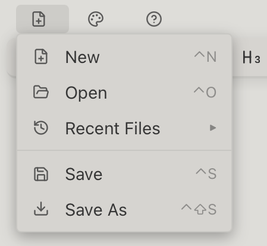
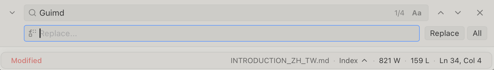

# Guimd 簡介

**Guimd**，這是一個專為寫作與閱讀而設計的免費Markdown編輯器。簡單、輕量，沒有複雜的功能，只有清楚簡潔的介面，讓您專注於寫作和編輯。

## 為什麼選擇 Guimd？

### 1. 所見即所得 (WYSIWYG)

不再需要看著混亂的符號或奇怪的程式碼，也不用記住Markdown語法。複製貼上後，也不會看到一堆奇怪的符號。

### 2. 跨平台APP

macOS, Windows, Linux 都可以使用。不需要在不同作業系統找尋類似，但不同的編輯器。

### 3. 羽量級，低負擔

體積小，執行速度快，同時開很多檔案也不會卡頓，不佔用系統資源。

### 4. 文件大綱導覽

可點擊的文件結構目錄，並結合視覺化的搜尋定位，讓文件導航流暢無阻。

## 使用者操作指南

### 1. 檔案管理

- **新建檔案**: 建立一個新的空白文件。
- **開啟檔案**: 開啟現有的 `.md` 檔案。
- **儲存 / 另存新檔**: 儲存您的工作內容。若有未儲存的變更，關閉前系統會主動提醒。
- **最近檔案**: 透過「檔案」選單快速存取最近編輯過的文件。

### 2. 文字格式化

使用頂部的極簡工具列：

- **樣式**: 粗體、斜體、底線。
- **結構**: 套用標題 1、2、3 (H1, H2, H3)。
- **列表**: 項目符號清單、編號清單、任務清單（核取方塊）。
- **進階**: 引用塊、程式碼塊、表格。
- **表格列控制**: 當游標在表格中時，工具列會顯示額外的圖示，讓您新增、移除列或欄位。
- **字體縮放**: 使用 **A+** 與 **A-** 圖示快速調整編輯器字體大小。
- **檢視模式**: 點擊**眼睛**圖示可在「編輯模式」與「閱讀模式」之間切換。

### 3. 連結與圖片

- **插入連結**: 點擊連結圖示。您可以同時設定「顯示文字」與「連結網址」。若先選取文字再點擊，文字會自動帶入。
- **插入圖片**: 點擊圖片圖示並輸入圖片的網址或本地路徑。

### 4. 導覽與搜尋

- **文件結構**: 點擊右下角的「**目錄**」按鈕可查看標題大綱。點擊標題可快速跳轉並視覺化定位該區域。

### 5. 頂部狀態列與底欄操作

- **重新載入**: 點擊頂部檔案路徑旁的旋轉箭頭，可從硬碟重新讀取檔案內容。
- **複製路徑**: 點擊頂部的檔案完整路徑，可將其複製到剪貼簿。
- **複製檔名**: 點擊右下角的檔案名稱，可快速複製該檔案名稱。
- **即時數據**: 底欄會即時顯示字數、行數，以及您目前的游標位置（行/列）。

### 6. 個人化設定與檢視

- **閱讀模式**: 點擊工具列的「**眼睛**」圖示，可在編輯模式與純淨的閱讀模式之間切換。
- **字體縮放**: 使用工具列的 **A+** 與 **A-** 圖示快速調整縮放比例。
- **佈景主題**: 在「檢視」選單中可切換淺色、深色、系統設定、電子紙模式。
- **語言**: 在「檢視」選單中選擇您偏好的介面語言。