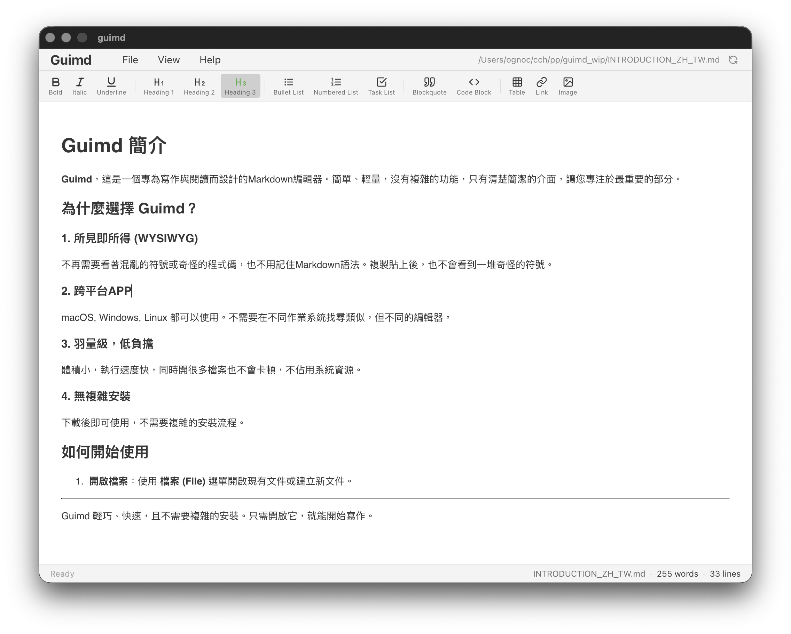

# Guimd:
[](https://app.fossa.com/projects/git%2Bgithub.com%2Fewigkeitab%2Fguimd?ref=badge_shield)


**Guimd** is a lightweight cross-platform Markdown editor designed for focusing on user writing experience.



### Key Highlights

- **No-code Editing**: No more confusing symbols or weird code.
- **Cross-Platform**: Available on Windows, Linux, and macOS. Let you share the same interface experience.
- **Lightweight & Fast**: Small in size and fast in execution. It use less memory and system resources.
- **No Complex Installation**: Ready to use after downloaded.
- **Minimalist Interface**: Pure focus on your content.

## Dependencies

Guimd utilizes several open-source libraries for its core functionality:

- [**Wails v2**](https://wails.io/): The framework for cross-platform desktop application development.
- [**Tiptap**](https://tiptap.dev/): The underlying engine for WYSIWYG Markdown editing.
- [**Goldmark**](https://github.com/yuin/goldmark) & [**html-to-markdown**](https://github.com/JohannesKaufmann/html-to-markdown): Libraries for Markdown parsing and conversion.
- [**Lucide React**](https://lucide.dev/): Source for user interface icons.

## **Using the ready-to-use executable App**

You can just download the latest files from the release section or from “release/” for macOS, Linux, ors Windows in this repository. Or you can clone this project and enjoy the build-from-source and have your own built files.

## User Instructions

- [正體中文](INTRODUCTION_ZH_TW.md)
- [English](INTRODUCTION.md)

## Setup & Building

### Prerequisites

To build Guimd from source, you need the following tools installed:

- **Go**: v1.24.0 or later
- **Node.js**: v16+ and **npm**
- **Wails CLI**: [Install Wails v2](https://wails.io/docs/gettingstarted/installation)

### Platform Dependencies

Linux

You need the GTK and WebKit2GTK development headers. On Debian/Ubuntu:

```
sudo apt install libgtk-3-dev libwebkit2gtk-4.1-dev
```

Windows

For building installers, install **NSIS** and **mingw-w64:**

```
sudo apt install nsis g++-mingw-w64-x86-64
```

### Build Instructions

The project uses a Makefile for streamlined builds:

1. **Install dependencies**:
   
   ```
   make install-deps
   ```
2. **Build for current platform**:
   
   ```
   make build
   ```
3. **Cross-platform packaging**:
   
   ```
   make package-all
   ```

## License

This project is licensed under the **MIT License**.

- [**MIT License (English)**](LICENSE)
- [**MIT License (繁體中文)**](LICENSE_ZH_TW.md)
- **Full Open Source License Compliance Audit Report**

* * *


[](https://app.fossa.com/projects/git%2Bgithub.com%2Fewigkeitab%2Fguimd?ref=badge_large)

## Release Notes

### v1.1.5 (2026-03-20)

- **feat**: Integrated **SPDX (ISO/IEC 5230)** compliance declaration to meet OpenChain international standards.
- **feat**: Added machine-readable **OWASP CycloneDX** v1.5 SBOM for automated security and compliance audits.
- **feat**: Updated project documentation paths to use relative links for improved portability.
- **docs**: Refined license audit reports with international standard references.

### v1.0.3 (2026-03-20)

- **feat**: Add view mode on toolbar button for better user experience.
- **feat**: Enhanced document structure menu with line numbers and direct navigation to sections.
- **feat**: Added MIT license and audit documentation.
- **feat**: Added macOS file association support.

### v1.0.2 (2026-03-07)

- **feat**: Implemented internationalization with dynamic language loading support.
- **feat**: Added document structure navigation popup window.
- **feat**: Improved UI design with new dialog headers and a new "epaper" editor theme.
- **docs**: Added comprehensive UI design system documentation.
- **refactor**: Updated styling for better alignment and responsiveness.