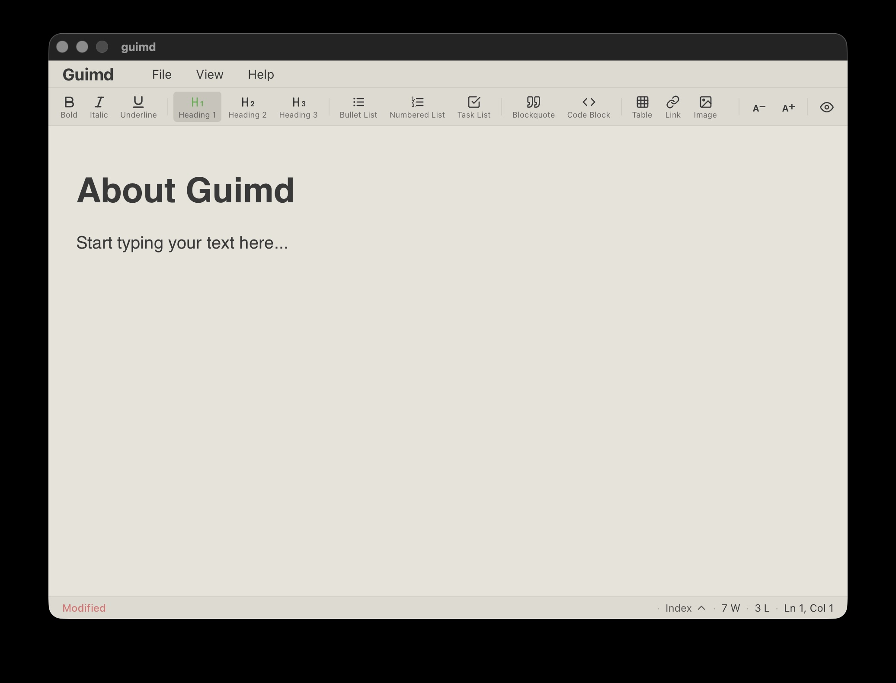

# Guimd: A Modern, Minimalist Markdown Editor for Everyone

**Guimd** is a light-weight cross-platform Markdown editor designed for focusing on writing experience.




### Key Highlights

- **WYSIWYG Editing**: No more confusing symbols or weird code. What you see is exactly what you get.
- **Cross-Platform**: Available on Windows, Linux, and macOS without different interfaces.
- **Lightweight & Fast**: Small in size and fast in execution. Won't lag even with multiple files open and doesn't consume heavy system resources.
- **No Complex Installation**: Ready to use immediately after downloading.
- **Minimalist Interface**: Pure focus on your content.

## Technical Setup & Building

### Prerequisites

To build Guimd from source, you need the following tools installed:

- **Go**: v1.24.0 or later
- **Node.js**: v16+ and **npm**
- **Wails CLI**: [Install Wails v2](https://wails.io/docs/gettingstarted/installation)

### Platform Dependencies

#### Linux

You need the GTK and WebKit2GTK development headers. On Debian/Ubuntu:

```bash
sudo apt install libgtk-3-dev libwebkit2gtk-4.1-dev
```

#### Windows

For building installers, install **NSIS** and **ming-w64**:

```bash
sudo apt install nsis g++-mingw-w64-x86-64
```

### Build Instructions

The project uses a `Makefile` for streamlined builds:

1. **Install dependencies**:
   
   ```bash
   make install-deps
   ```
2. **Build for current platform**:
   
   ```bash
   make build
   ```
3. **Cross-platform packaging**:
   
   ```bash
   make package-all
   ```